# MPSQCL Pipeline Documentation: Multi-Positive Sample Quantum Contrastive Learning for HAR

This document provides a comprehensive end-to-end description of the pipeline proposed in the **MPSQCL** paper:
* **Paper Title**: *Multi-Positive Sample Quantum Contrastive Learning for Human Activity Recognition* (IEEE GLOBECOM 2024)
* **Authors**: Yanhui Ren, Di Wang, Lingling An, Shiwen Mao, Xuyu Wang

It details the theoretical pipeline stages, how they are mapped onto the codebase, and provides an exhaustive side-by-side comparison of every minute difference between our **Paper-Compliant** pipeline and our **Standard** pipeline.

---

## 1. Theoretical Pipeline Architecture

The MPSQCL pipeline extends traditional 2-view contrastive frameworks by utilizing multiple positive samples (M augmented views) in combination with a hybrid classical-quantum structure to capture rich sample diversity and mitigate hardware bottlenecks.

```mermaid
flowchart TD
    subgraph Stage1 ["Stage 1: Data Preprocessing & Split"]
        Raw[Raw Wearable Sensor Data] --> Prep[Normalization & Segmenting]
        Prep --> Window[Sliding Window: 50% Overlap]
        Window --> Split[Random Split: 64% Train / 16% Val / 20% Test]
    end

    subgraph Stage2 ["Stage 2: Multi-View Augmentation & Collation"]
        Split --> Sampler[Weighted Random Sampler]
        Sampler --> Aug[M-View Generation: Dataset-Specific Optimal Combinations]
        Aug --> Collate[Collate M views into stacked tensors]
    end

    subgraph Stage3 ["Stage 3: Phase 1 Pre-Training"]
        Collate --> Encoder[1D CNN HAREncoderPaper]
        Encoder --> Feature[M x 256-dim Feature Vectors]
        Feature --> VQC[Quantum Projection Head VQC]
        VQC --> Project[M x 8-dim Expectations z_i^1, ..., z_i^M]
    end

    subgraph Stage4 ["Stage 4: Multi-Positive Optimization"]
        Project --> Loss[MPSQCLLoss Calculation]
        Loss --> Opt[Optimize Encoder + VQC]
        Opt --> Checkpoint{Validation Loss Improvement?}
        Checkpoint -- Yes --> Save[Save Best Encoder Checkpoint]
    end

    subgraph Stage5 ["Stage 5: Phase 2 Fine-Tuning"]
        Save --> Load[Load Best Pre-trained Encoder]
        Load --> Freeze[Freeze Encoder Weight Gradients]
        Freeze --> Norm[L2-normalize Extracted Features]
        Norm --> Classifier[Classical Linear Head]
        Classifier --> CE[Cross-Entropy Loss Classification]
    end
```



---

## 2. Codebase Implementation Mapping

The theoretical stages are implemented in the codebase across the following modules:

* **Training Orchestration**:
  - Paper-Compliant Pre-training & Fine-tuning: [experiments/run_mpsqcl_har_paper.py](file:///home/avnis/dev/projects/QMLHAR/experiments/run_mpsqcl_har_paper.py)
  - Standard Pre-training & Fine-tuning: [experiments/run_mpsqcl_har.py](file:///home/avnis/dev/projects/QMLHAR/experiments/run_mpsqcl_har.py)
* **Data Preprocessing & Loading**:
  - Dataloader split & balance generator: [get_paper_dataloaders](file:///home/avnis/dev/projects/QMLHAR/src/data/har_datasets_paper.py#L554-L663) in [har_datasets_paper.py](file:///home/avnis/dev/projects/QMLHAR/src/data/har_datasets_paper.py)
* **Multi-View Augmentations**:
  - Paper-Compliant Generator: [ContrastiveViewGeneratorPaper](file:///home/avnis/dev/projects/QMLHAR/src/data/augmentations_paper.py#L35-L98) in [augmentations_paper.py](file:///home/avnis/dev/projects/QMLHAR/src/data/augmentations_paper.py) (instantiated with `dataset_name` to trigger optimal paper combinations)
  - Standard Generator: [ContrastiveViewGenerator](file:///home/avnis/dev/projects/QMLHAR/src/data/augmentations.py#L281-L318) in [augmentations.py](file:///home/avnis/dev/projects/QMLHAR/src/data/augmentations.py) (instantiated with `--n_views` only)
* **Neural Network Modules**:
  - Paper-Compliant Encoder: [HAREncoderPaper](file:///home/avnis/dev/projects/QMLHAR/src/models/encoder.py#L111-L126) in [encoder.py](file:///home/avnis/dev/projects/QMLHAR/src/models/encoder.py)
  - Standard Encoder: [HAREncoder](file:///home/avnis/dev/projects/QMLHAR/src/models/encoder.py#L18-L109) in [encoder.py](file:///home/avnis/dev/projects/QMLHAR/src/models/encoder.py)
  - Paper-Compliant Projection Head: [QuantumProjectionHeadPaper](file:///home/avnis/dev/projects/QMLHAR/src/models/quantum_head.py#L93-L196) in [quantum_head.py](file:///home/avnis/dev/projects/QMLHAR/src/models/quantum_head.py)
  - Standard Projection Head: [QuantumProjectionHead](file:///home/avnis/dev/projects/QMLHAR/src/models/quantum_head.py#L18-L91) in [quantum_head.py](file:///home/avnis/dev/projects/QMLHAR/src/models/quantum_head.py)
* **Loss Functions**:
  - Multi-Positive Contrastive Loss: [MPSQCLLoss](file:///home/avnis/dev/projects/QMLHAR/src/losses/mpsqcl_loss.py#L17-L129) in [mpsqcl_loss.py](file:///home/avnis/dev/projects/QMLHAR/src/losses/mpsqcl_loss.py)

---

## 3. Paper-Compliant vs. Standard Pipeline Differences

There are critical structural and hyperparameter differences between the paper-compliant replication and the standard baseline implementation.

| Pipeline Stage | Paper-Compliant Setup (`run_mpsqcl_har_paper.py`) | Standard Setup (`run_mpsqcl_har.py`) | Rationale / Impact |
| :--- | :--- | :--- | :--- |
| **Stage 1: Preprocessing & Splitting** | Enables `WeightedRandomSampler` to balance class frequencies; hardcoded subject exclusions and grid downsampling. Split is exactly **64% / 16% / 20%**. | Standard random loading (unless `--use_sampler` flag is explicitly passed) with standard train/val/test splits. | The weighted random sampler oversamples minority classes, resolving training bias in imbalanced datasets. |
| **Stage 2: Augmentation & Collation** | Generates $M$ views using **dataset-specific optimal augmentation sets** from Table III (e.g. 5 views for UCI-HAR, 6 for HHAR, 5 for MotionSense, 4 for USC-HAD). Uses resampling, permutation-jitter, noise, temporal flip, rotate, negate, permute, time warp. | Generates $M$ views (default 4) by randomly drawing from the pool of **11 strategies** (including cubic spline time warp, window warp, and channel shuffle). | Applying exact combinations guarantees the same augmentation intensity described in the paper. Standard selection is random and unstructured. |
| **Stage 3: CNN Encoder** | Uses [HAREncoderPaper](file:///home/avnis/dev/projects/QMLHAR/src/models/encoder.py#L111-L126). Final block 4 uses **Adaptive Max Pooling 1D**. | Uses [HAREncoder](file:///home/avnis/dev/projects/QMLHAR/src/models/encoder.py#L18-L109). Final block 4 uses **Adaptive Average Pooling 1D** by default. | Max pooling captures peak signals (e.g. impact activities), while average pooling smoothes signal structures across the entire sequence. |
| **Stage 4: VQC Projection Head** | Uses [QuantumProjectionHeadPaper](file:///home/avnis/dev/projects/QMLHAR/src/models/quantum_head.py#L93-L196). Depth $D=1$ custom circuit with **8 parameters** (Ry + CNOT ring connecting adjacent qubits). | Uses [QuantumProjectionHead](file:///home/avnis/dev/projects/QMLHAR/src/models/quantum_head.py#L18-L91). Depth $D=3$ circuit with **72 parameters** (`StronglyEntanglingLayers`). | The paper head maximizes parameter efficiency. Standard StronglyEntanglingLayers increase circuit expressivity but scale simulation times. |
| **Stage 5: Pre-Training Loss & Logic** | Computes loss using [MPSQCLLoss](file:///home/avnis/dev/projects/QMLHAR/src/losses/mpsqcl_loss.py#L17-L129). Runs **validation loop** during pre-training and selects the encoder with the **lowest validation loss**. LR is **3e-3** (1e-2 for SHAR). | Computes loss using [MPSQCLLoss](file:///home/avnis/dev/projects/QMLHAR/src/losses/mpsqcl_loss.py#L17-L129). No validation loop during pre-training; simply saves the final epoch or periodic checkpoint. LR defaults to **1e-3**. | Saving the encoder with the lowest validation loss prevents representation overfitting. |
| **Stage 5: VQC Simulator Backpropagation** | Employs statevector backpropagation (`diff_method="backprop"`). | Implicitly falls back to parameter-shift derivative calculations (requires $2 \times N_{\text{params}}$ simulator runs per sample). | Backpropagation reduces pre-training runtimes by **100x** compared to parameter-shift on classical simulators. |
| **Stage 6: Fine-Tuning Classifier** | **Frozen** encoder (`requires_grad = False`). Features are **L2-normalized** before classification. Optimizer LR is **1e-1** (Adam, cosine annealing) for the classifier head. | **Unfrozen** encoder. Optimizer updates encoder slowly ($1\text{e-4}$) and classifier faster ($1\text{e-3}$). Features are not normalized. | Locking and L2-normalizing representations tests pure feature extraction. Unfreezing adapts the encoder, boosting downstream accuracy. |
| **NISQ Noise Simulation** | Supported via `--noise_prob` and `--noise_std` parameters. Simulates RX rotation errors before each quantum gate. | No noise simulation support. | Evaluates model robustness against NISQ hardware measurement errors. |
| **Target Metric** | Primary: **Macro F1-score**. Secondary: Test Accuracy. | Primary: **Test Accuracy**. | F1-score is highly sensitive to minority classes in imbalanced classification. |

---

## 4. Comprehensive Stage-by-Stage Implementation Details

### Stage 1: Data Preparation & Preprocessing
* **Sensor Channels**: Extracts accelerometer and gyroscope streams depending on the dataset. HHAR uses 6 channels, MotionSense uses user-acceleration (3 channels) in the paper, whereas standard utilizes 12 channels.
* **Segmentation**: Continuous signals are partitioned using sliding windows with a **50% overlap**. Window sizes:
  - UCI-HAR: 128 timesteps
  - SHAR: 151 timesteps
  - HHAR: 100 timesteps (downsampled to 50 Hz, phone devices only)
  - MotionSense: 400 timesteps
  - USC-HAD: 250 timesteps
  - MobiAct: 128 timesteps (falls excluded, ADL classes only)
* **Splitting**: Split into **64% Train / 16% Val / 20% Test** random sets.
* **Code Implementation**:
  ```python
  train_loader, val_loader, test_loader, in_channels, _, num_classes = get_paper_dataloaders(
      dataset_name=args.dataset,
      data_dir=args.data_dir,
      batch_size=args.batch_size,
      transform=transform,
      collate_fn=mps_contrastive_collate_fn,
      seed=args.seed
  )
  ```

### Stage 2: Augmentation & Collation
* **Augmentations**:
  - `resample`: Shifts temporal resolution via linear interpolation.
  - `perm_jit`: Slices the signal into 5 segments, shuffles them, and adds Gaussian noise ($\sigma=0.05$).
  - `noise`: Adds zero-mean Gaussian noise ($\sigma=0.05$).
  - `temporal_flip`: Reverses the signal along the time axis.
  - `rotate`: Applies a random 3D rotation matrix to each 3-axis sensor group.
  - `negate`: Vertically flips signal polarities.
  - `permute`: Shuffles 5 sliced segments.
  - `time_warp`: Warps time-series non-linearly using cubic spline interpolation.
* **Replication Logic**: In pre-training, each signal $x$ is copied into $M$ views. Depending on the dataset, each of the $M$ views applies a specific optimal transformation once:
  - *UCI-HAR ($M=5$)*: `resample` + `perm_jit` + `noise` + `temporal_flip` + `rotate`
  - *HHAR ($M=6$)*: `resample` + `perm_jit` + `negate` + `noise` + `temporal_flip` + `rotate`
  - *MotionSense ($M=5$)*: `resample` + `perm_jit` + `noise` + `rotate` + `permute`
  - *USC-HAD ($M=4$)*: `time_warp` + `resample` + `perm_jit` + `noise`
  - *Others (SHAR, MobiAct, Opportunity)*: Default generation applies Resampling (50% prob) and Negate (50% prob) with a deduplication loop.
* **Collation**: Custom collate function stacks views index-wise, returning a tuple of $M$ stacked tensors:
  ```python
  def mps_contrastive_collate_fn(batch):
      n_views = len(batch[0][0])
      views_list = [[] for _ in range(n_views)]
      labels = []
      for views, label in batch:
          for idx in range(n_views):
              views_list[idx].append(views[idx])
          labels.append(label)
      stacked_views = [torch.stack(v) for v in views_list]
      return tuple(stacked_views), torch.stack(labels)
  ```

### Stage 3: Classical Feature Extraction (CNN Encoder)
* **Network Layout**: A 4-layer Fully Convolutional Network (FCN).
  - *Layer 1*: $Conv1D(\text{in\_channels}, 32, k=8) \to BatchNorm \to ReLU \to MaxPool(2) \to Dropout(0.35)$
  - *Layer 2*: $Conv1D(32, 64, k=8) \to BatchNorm \to ReLU \to MaxPool(2)$
  - *Layer 3*: $Conv1D(64, 128, k=8) \to BatchNorm \to ReLU \to MaxPool(2)$
  - *Layer 4 (Paper-Compliant)*: $Conv1D(128, 256, k=8) \to BatchNorm \to ReLU \to AdaptiveMaxPool1D(1) \to Squeeze$
  - *Layer 4 (Standard)*: $Conv1D(128, 256, k=8) \to BatchNorm \to ReLU \to AdaptiveAvgPool1D(1) \to Squeeze$
* **Output**: A 256-dimensional feature vector per view (M vectors per sample).
* **Code Implementation**:
  ```python
  # Paper-compliant
  encoder = HAREncoderPaper(in_channels=in_channels, feature_dim=256)
  # Standard
  encoder = HAREncoder(in_channels=in_channels, feature_dim=256)
  ```

### Stage 4: Quantum Projection Head (VQC)
* **Quantum Embedding**: Classically normalized 256-dimensional features are mapped onto the amplitudes of an 8-qubit system ($2^8 = 256$) using **Amplitude Encoding**.
* **Variational Layers (PQC)**:
  - *Paper-Compliant*: Appears as a single layer ($D=1$). On each qubit $j$, a parameterized rotation $RY(\theta_j)$ is applied. Adjacent qubits are then entangled via a ring of CNOT gates: $CNOT(0,1), CNOT(1,2), \dots, CNOT(6,7)$. It contains exactly 8 learnable parameters.
  - *Standard*: Alternates $D=3$ layers of $StronglyEntanglingLayers$ containing $3 \text{ layers} \times 8 \text{ qubits} \times 3 \text{ rotations} = 72$ learnable parameters.
* **Measurement**: Measures expectation values of the Pauli-Z operator on all 8 qubits, yielding an 8-dimensional projection:
  $$z_j = \langle \psi \vert \sigma_z^j \vert \psi \rangle, \quad j \in [0, 7]$$
  The projection is L2-normalized onto the unit hypersphere.
* **Code Implementation**:
  ```python
  # Paper-compliant
  quantum_head = QuantumProjectionHeadPaper(input_dim=256, num_qubits=8, q_layers=1)
  # Standard
  quantum_head = QuantumProjectionHead(input_dim=256, num_qubits=8, q_layers=3)
  ```

### Stage 5: Phase 1 Pre-Training (MPSQCL Loss)
* **Optimization Objective**: Maximizes similarity between all $M$ positive views of the same sample, while minimizing similarity to negative sample views.
* **MPSQCLLoss Formulation**:
  $$L_i = \frac{1}{|P(i)|} \sum_{p \in P(i)} -\log \left( \frac{\exp(\text{sim}(z_i, z_p) / \tau)}{\sum_{k=1}^{M \times B} \mathbb{1}_{[k \neq i, k \notin P(i)]} \exp(\text{sim}(z_i, z_k) / \tau)} \right)$$
  Where $B$ is the batch size, $\tau=0.1$ is the temperature, and similarity is computed as the quantum state inner product (cosine similarity). By default in the paper, the denominator includes all different sample views + the anchor itself (i.e. excluding other positive views of the same sample $P(i)$).
* **Optimizer**: Adam optimizer with weight decay $1\text{e-}5$. Pre-training is executed for 120 epochs using Cosine Annealing learning rate decay.
* **Code Implementation**:
  ```python
  criterion = MPSQCLLoss(temperature=args.temperature, exclude_anchor_from_denominator=args.exclude_anchor)
  
  # Forward pass in pretrain loop
  z_list = []
  for v in views:
      h = encoder(v)
      z = quantum_head(h)
      z_list.append(z)
  loss = criterion(z_list)
  ```

### Stage 6: Phase 2 Fine-Tuning & Classification
* **Encoder Freezing**: Encoder weights are locked (`param.requires_grad = False` and `.eval()`), acting strictly as a static feature extractor.
* **Linear Classifier**: The VQC head is discarded and replaced with a classical linear layer (`nn.Linear(256, num_classes)`).
* **Training Logic**: Features extracted from raw sequences are **L2-normalized** and passed through the classifier. It is optimized under Cross-Entropy Loss for 100 epochs using Adam ($LR=0.1$) with Cosine Annealing learning rate decay.
* **Code Implementation**:
  ```python
  # Freeze encoder
  for param in encoder.parameters():
      param.requires_grad = False
  encoder.eval()

  classifier = nn.Linear(256, num_classes).to(device)
  optimizer = optim.Adam(classifier.parameters(), lr=1e-1)
  
  # Forward pass in training loop
  with torch.no_grad():
      features = encoder(inputs)
      features = torch.nn.functional.normalize(features, p=2, dim=1) # L2 Normalization
  logits = classifier(features)
  ```

---

## 5. Paper-Compliance Notes

While the paper-compliant replication script ([run_mpsqcl_har_paper.py](file:///home/avnis/dev/projects/QMLHAR/experiments/run_mpsqcl_har_paper.py)), custom datasets, and multi-view generation configurations replicate the core architecture and loss described in the MPSQCL paper (IEEE GLOBECOM 2024), the training and evaluation details are synthesized with the more detailed journal version (QCLHAR, Smart Health 2025). Specifically, the following details are implemented:

1. **Epochs & Schedule Synthesis**: The MPSQCL paper specifies a baseline of 100 epochs per experiment. To align with the expanded journal QCLHAR findings and code patterns, the pre-training defaults (120 epochs), dropout ($p=0.35$ in Layer 1), dataset splits ($64\%/16\%/20\%$), and validation-based checkpointing are adopted.
2. **Adam Weight Decay ($1\text{e-}5$)**: Not explicitly stated in either paper, but added to provide standard regularization.
3. **Feature L2 Normalization in Fine-Tuning**: Features extracted by the frozen encoder are $L_2$-normalized before being input to the downstream classification layer (Stage 6) to improve linear classification training stability.
4. **Adaptive Pooling**: PyTorch `AdaptiveMaxPool1D` is used for the "max-pooling" implementation to accommodate varying sequence lengths dynamically across the multi-dataset framework.

---

## 6. Empirical Ablation Analysis

To evaluate the impact of the changes between the paper-compliant baseline and standard baseline settings, we conducted two ablation studies on subsets of the UCI-HAR dataset under controlled pre-training and fine-tuning epochs:

### Phase 1: 20% Dataset, 20 Epochs

| Configuration | Pre-training Val Loss | Test Accuracy | Test Macro F1-score | Delta F1 (vs. Paper Baseline) |
| :--- | :---: | :---: | :---: | :---: |
| **Config 0: Paper-Compliant Baseline** | 3.8601 | 83.16% | 0.8292 | - |
| **Config 1: Paper + Unfrozen Encoder** | 3.5746 | 76.52% | 0.7522 | -7.70% |
| **Config 2: Paper + Deeper VQC (D=3)** | 3.6691 | 86.12% | 0.8584 | +2.92% |
| **Config 3: Paper + Average Pooling** | 3.8858 | 84.76% | 0.8452 | +1.60% |
| **Config 4: Paper + 11-Augmentation Pool** | 3.6292 | 86.07% | 0.8544 | +2.52% |
| **Config 5: Paper + Unweighted Sampler** | 3.8166 | 86.66% | 0.8620 | +3.28% |
| **Config 6: Paper + No Feature Normalization** | 4.0917 | 85.88% | 0.8535 | +2.43% |
| **Config 7: Standard Pipeline (All Combined)** | 3.3437 | **89.67%** | **0.8911** | **+6.20%** |

#### Phase 1 Key Insights:
* **Frozen vs. Unfrozen Encoder**: Unfreezing the encoder during Phase 2 on limited data subsets over short training schedules degrades F1 performance (-7.70%) due to convergence overhead of 347k parameters.
* **Deeper VQC Projection Head**: Utilizing a depth $D=3$ projection head (StronglyEntanglingLayers, 72 parameters) increases the representation capacity, yielding a +2.92% F1 improvement.
* **Average vs. Max Pooling**: Replacing max-pooling with average-pooling in the encoder block 4 recovers +1.60% F1 by retaining global signal sequence statistics instead of peak spikes.
* **Augmentation Variety**: Choosing from the full 11-augmentation pool (+2.52% F1) prevents overfitting on orientation/noise patterns and forces the model to learn invariant representations.
* **Unweighted vs. Weighted Sampler**: Removing the weighted sampler (+3.28% F1) avoids oversampling redundant samples on the already balanced UCI-HAR dataset.
* **No Feature Normalization**: Disabling feature normalization before classification (+2.43% F1) preserves absolute signal scale information.
* **Standard Pipeline**: Combining all improvements leads to the overall best performance of **89.67% test accuracy** (+6.20% F1 improvement).

### Phase 2: 40% Dataset, 50 Epochs

| Configuration | Pre-training Val Loss | Test Accuracy | Test Macro F1-score | Delta F1 (vs. Paper Baseline) |
| :--- | :---: | :---: | :---: | :---: |
| **Config 0: Paper-Compliant Baseline** | 3.2221 | 90.59% | 0.9047 | - |
| **Config 1: Paper + Unfrozen Encoder** | 3.1171 | 90.59% | 0.9044 | -0.03% |
| **Config 2: Paper + Deeper VQC (D=3)** | 3.0449 | 91.51% | 0.9136 | +0.90% |
| **Config 3: Paper + Average Pooling** | 3.2312 | 89.08% | 0.8879 | -1.68% |
| **Config 4: Paper + 11-Augmentation Pool** | 2.8228 | 92.77% | 0.9283 | +2.37% |
| **Config 5: Paper + Unweighted Sampler** | 3.1441 | 91.27% | 0.9104 | +0.58% |
| **Config 6: Paper + No Feature Normalization** | 3.1604 | 92.14% | 0.9201 | +1.54% |
| **Config 7: Standard Pipeline (All Combined)** | 2.6110 | **95.78%** | **0.9614** | **+5.67%** |

#### Phase 2 Key Insights:
* **Encoder Unfreezing Convergence**: With longer schedules (50 epochs) and a larger dataset fraction (40%), the unfrozen encoder has successfully converged to **90.44% F1** (virtually identical to the frozen baseline, -0.03% delta). This confirms that unfreezing is viable and scales well with longer schedules and larger datasets.
* **Pooling Swap**: Max pooling performs slightly better than average pooling in this specific single-ablation run on the larger dataset (-1.68% F1). However, when combined with other features in the Standard Pipeline (Config 7), average pooling is highly effective, indicating complex interactions with other layers.
* **Deeper VQC**: A deeper $D=3$ projection head continues to outperform the paper's $D=1$ custom head (+0.90% F1).
* **11-Augmentation Pool**: Using the full pool of 11 augmentations remains very strong (+2.37% F1).
* **No Feature Normalization**: Disabling feature normalization before classification yields +1.54% F1, preserving absolute signal scale.
* **Standard Pipeline**: Combining all improvements leads to the overall best performance of **95.78% test accuracy** (+5.67% F1 improvement).

### Phase 3: Standard Pipeline Baseline Ablation (40% Dataset, 50 Epochs)

In this study, we started with the fully optimized **Standard Pipeline** as our baseline (Config 0) and isolated the impact of reverting each component to its paper-compliant counterpart:

| Configuration | Pre-training Val Loss | Test Accuracy | Test Macro F1-score | Delta F1 (vs. Standard Baseline) |
| :--- | :---: | :---: | :---: | :---: |
| **Config 0: Standard Baseline** | 2.7942 | 95.83% | 0.9621 | - |
| **Config 1: Standard - Average Pooling** | 2.6134 | 95.58% | 0.9596 | -0.26% |
| **Config 2: Standard - Unweighted Sampler** | 2.6821 | 95.63% | 0.9599 | -0.22% |
| **Config 3: Standard - Deeper VQC** | 2.7735 | 95.34% | 0.9570 | -0.51% |
| **Config 4: Standard - Unfrozen Encoder** | 2.7130 | 94.52% | 0.9459 | -1.62% |

#### Phase 3 Key Insights:
* **Unfrozen vs. Frozen Encoder**: Freezing the CNN encoder weights during Phase 2 training drops performance significantly (**-1.62% F1**). This demonstrates that adapting representations to downstream classifications during fine-tuning provides large benefits when given sufficient epochs (50) and training data (40%).
* **Deeper VQC Head**: Reverting from StronglyEntanglingLayers ($D=3$, 72 parameters) to the paper's custom VQC ($D=1$, 8 parameters) drops performance by **-0.51% F1**, confirming that circuit depth directly affects latent representation quality.
* **Average vs. Max Pooling**: Reverting to max pooling drops F1 by **-0.26%**, indicating average pooling remains better for extracting global temporal signatures.
* **Weighted Sampler**: Re-introducing the weighted class sampler drops F1 by **-0.22%** because UCI-HAR is already balanced, and class oversampling leads to redundant duplicates and mild overfitting.
* **Summary**: Each standard optimization contributes positively to the final classification, with the fully optimized Standard Pipeline achieving peak performance (**95.83% test accuracy** and **0.9621 F1-score**).

### Phase 4: Candidate Configuration Benchmarks (100% Dataset, 100 Epochs)

We scaled up the top candidates to run on 100% of the `ucihar` dataset for a full 100-epoch training schedule:

| Configuration | Pre-training Val Loss | Test Accuracy | Test Macro F1-score | Delta F1 (vs. Standard Baseline) |
| :--- | :---: | :---: | :---: | :---: |
| **Candidate 1: Fully Optimized Standard (Depth-3 VQC)** | 2.5978 | **98.11%** | **0.9828** | - |
| **Candidate 2: Depth-2 VQC Standard** | 2.6361 | 98.01% | 0.9819 | -0.08% |
| **Candidate 3: Speed-Optimized Standard (Depth-1 VQC)** | 2.6429 | 97.96% | 0.9814 | -0.13% |
| **Candidate 4: Frozen Encoder Standard** | 2.6523 | 97.91% | 0.9807 | -0.20% |
| **Candidate 5: Paper-Compliant Baseline** | 3.3005 | 92.82% | 0.9269 | -5.59% |

#### Phase 4 Key Insights:
* **State-of-the-Art Cumulative Gains**: The fully optimized Standard Pipeline (Candidate 1) outperforms the strict Paper-Compliant Baseline (Candidate 5) by **+5.59% F1** and **+5.29% accuracy** (achieving a peak of **98.11% accuracy**).
* **Quantum Head Sufficiency**: A depth-2 StronglyEntangling VQC (48 parameters) or even a shallow depth-1 custom VQC (8 parameters) performs almost identically to the depth-3 head (**-0.08% F1** and **-0.13% F1** differences, respectively), while running up to **5x faster to pre-train**. This reveals that the VQC acts as a lightweight projection helper, leaving the heavy representational lifting to the classical CNN encoder.
* **Encoder Freezing**: Unfreezing the encoder weights during fine-tuning (Candidate 1) provides a modest **+0.20% F1** gain over locking the weights (Candidate 4). This confirms that pre-trained weights become highly generalizable under full dataset exposure, although adaptation still yields a marginal improvement.

### Phase 5: Candidates on Small & Imbalanced Dataset (20% Dataset, 50 Epochs, 2D VQC)

We benchmarked the candidate configurations with 2D VQC heads (depth-2 StronglyEntanglingLayers) on the highly imbalanced **UniMiB SHAR (shar)** dataset using a small subset (20% data fraction, ~1,500 training samples) to represent a low-data regime:

| Configuration | Pre-training Val Loss | Test Accuracy | Test Macro F1-score | Delta F1 (vs. Standard Baseline) |
| :--- | :---: | :---: | :---: | :---: |
| **Candidate 1: Fully Optimized Standard (Depth-2 VQC)** | 1.7371 | 56.27% | 0.3864 | - |
| **Candidate 2: Speed-Optimized Standard (Depth-1 VQC)** | 1.6803 | 55.11% | 0.3811 | -0.53% |
| **Candidate 3: Frozen Encoder Standard (Depth-2 VQC)** | 1.5970 | **70.19%** | **0.5989** | **+21.25%** |
| **Candidate 4: Weighted Sampler Standard (Depth-2 VQC)** | 1.7909 | 54.26% | 0.4416 | **+5.52%** |
| **Candidate 5: Paper-Compliant Baseline** | 0.8049 | 39.90% | 0.3815 | -0.49% |

#### Phase 5 Key Insights:
* **The Frozen Encoder Overfitting Guard**: Freezing the CNN encoder weights during fine-tuning (Candidate 3) yields a massive **+21.25% Macro F1-score** improvement (scoring **70.19% accuracy / 0.5989 F1** vs. 0.3864 F1 unfrozen). This proves that under small data regimes, unfreezing weights leads to severe representation destruction and overfitting, making frozen weights the essential choice.
* **Weighted Sampling for Imbalance**: Adding class-weighted random sampling (Candidate 4) boosts F1-score by **+5.52% F1** over the unweighted baseline, verifying that batch class balancing is required to resolve representation bias toward majority categories.
* **Standard Optimizations Superiority**: Candidate 3 (Frozen Standard) outperforms Candidate 5 (Paper Baseline, also frozen) by **+30.29% accuracy** and **+21.74% F1-score**, proving that our core architectures (Average Pooling, Deeper VQC, unnormalized classifier features) remain vastly superior even in small, imbalanced environments.
* **VQC Depth**: The VQC depth difference remains marginal on small datasets (Candidate 2 depth-1 drops only **-0.53% F1** vs Candidate 1 depth-2).

### Phase 6: Candidates on 100% Imbalanced Dataset (100% Dataset, 100 Epochs, 2D VQC)

We benchmarked the candidate configurations with 2D VQC heads (depth-2 StronglyEntanglingLayers) on the full (100%) highly imbalanced **UniMiB SHAR (shar)** dataset for a full 100-epoch schedule:

| Configuration | Pre-training Val Loss | Test Accuracy | Test Macro F1-score | Delta F1 (vs. Standard Baseline) |
| :--- | :---: | :---: | :---: | :---: |
| **Candidate 1: Fully Optimized Standard (Depth-2 VQC)** | 1.8888 | 80.11% | 0.7131 | - |
| **Candidate 2: Speed-Optimized Standard (Depth-1 VQC)** | 1.8445 | 77.55% | 0.6602 | -5.29% |
| **Candidate 3: Frozen Encoder Standard (Depth-2 VQC)** | 1.8148 | **89.84%** | **0.8535** | **+14.04%** |
| **Candidate 4: Weighted Sampler Standard (Depth-2 VQC)** | 2.0881 | 76.70% | 0.6674 | -4.57% |
| **Candidate 5: Paper-Compliant Baseline** | 0.8425 | 59.67% | 0.5719 | -14.12% |

#### Phase 6 Key Insights:
* **The Frozen Encoder Supremacy on SHAR**: Freezing the CNN encoder weights during fine-tuning (Candidate 3) yields a massive **+14.04% Macro F1-score** improvement (scoring **89.84% accuracy / 0.8535 F1** vs. 0.7131 F1 unfrozen). This demonstrates that on highly imbalanced and complex datasets like UniMiB SHAR, unfreezing the encoder leads to significant overfitting even under full data exposure, making frozen encoders the optimal choice.
* **Large Standard Optimizations Gains**: Candidate 3 (Frozen Standard) outperforms Candidate 5 (Paper Baseline, also frozen) by **+30.17% accuracy** and **+28.16% Macro F1-score** (**89.84% accuracy / 0.8535 F1** vs. **59.67% accuracy / 0.5719 F1**). This validates the huge cumulative advantage of Average Pooling, 2D VQC, and unnormalized classifier features under full scale execution.
* **VQC Depth Importance on Imbalance**: Reverting from depth-2 StronglyEntangling VQC (Candidate 1) to depth-1 custom VQC (Candidate 2) drops F1 by **-5.29% F1**. This reveals that on imbalanced datasets, a deeper quantum head is essential during pre-training to establish complex separation boundaries for minority classes in the Hilbert space.

### Phase 7: Candidates on 100% Imbalanced Dataset (100% Dataset, 100 Epochs, Depth-3 VQC)

We benchmarked the standard candidates using a higher capacity **depth-3 StronglyEntangling VQC** (72 parameters) on 100% of the UniMiB SHAR dataset:

| Configuration | Pre-training Val Loss | Test Accuracy | Test Macro F1-score | Delta F1 (vs. Standard Baseline) |
| :--- | :---: | :---: | :---: | :---: |
| **Candidate 1: Fully Optimized Standard (Depth-3 VQC)** | 1.9416 | 76.34% | 0.6520 | - |
| **Candidate 2: Frozen Encoder Standard (Depth-3 VQC)** | 1.8494 | **89.29%** | **0.8485** | **+19.65%** |

#### Phase 7 Key Insights:
* **The Frozen Encoder Vital Role**: Freezing the CNN encoder weights during fine-tuning (Candidate 2) yields a massive **+19.65% Macro F1-score** improvement (scoring **89.29% accuracy / 0.8485 F1** vs. 0.6520 F1 unfrozen). This confirms that on imbalanced data, unfreezing the encoder weights causes severe downstream overfitting.
* **Quantum Depth Overfitting Boundary (Depth-2 vs. Depth-3)**:
  - Comparing Phase 7 (Depth-3 VQC) to Phase 6 (Depth-2 VQC) shows that **Depth-2 VQC yields the overall highest macro F1-score** (**0.8535 F1** vs. **0.8485 F1**, and **89.84% accuracy** vs. **89.29%**).
  - *Analysis*: In highly imbalanced contexts, the extra parameters of a depth-3 VQC head (72 parameters) can lead to minor representation overfitting of majority classes during pre-training, reducing minority class boundary clarity. A depth-2 head (48 parameters) provides the optimal modeling capacity, separating categories cleanly without overfitting.

### Phase 8 & 9: Candidate Encoders + Classical LSTM Fine-Tuning (100% SHAR, 100 Epochs)

We modified the candidates script to automatically save pre-trained encoder weights to disk, ran 3 selected Depth-1 & Depth-2 candidates on 100% of the imbalanced UniMiB SHAR dataset, and fine-tuned a classical PyTorch LSTM classifier head (128 hidden dim, 2 layers) on top of each pre-trained encoder:

| Pre-trained Encoder Checkpoint | Test Accuracy | Test Macro F1-score | Total Training Time | Best Val Epoch |
| :--- | :---: | :---: | :---: | :---: |
| **Candidate 1: Fully Optimized Standard (Depth-2 VQC)** | 84.43% | 0.7906 | 39.7s | Epoch 71 |
| **Candidate 2: Speed-Optimized Standard (Depth-1 VQC)** | **85.28%** | **0.8009** | 38.5s | Epoch 86 |
| **Candidate 3: Frozen Encoder Standard (Depth-2 VQC)** | 82.24% | 0.7486 | 34.8s | Epoch 71 |

#### Phase 8 & 9 Key Insights:
* **The VQC Bottleneck Benefit for Sequence Modeling**: Candidate 2 (Depth-1 pre-trained encoder) achieves the best overall performance (**85.28% accuracy / 0.8009 F1**), beating the Depth-2 encoder by **+1.03% F1**. A shallower (depth-1) quantum head imposes a milder feature bottleneck during contrastive alignment, forcing the CNN encoder to retain richer temporal features, which classical sequential classifiers like LSTMs rely on.
* **Pre-Training Freeze Disadvantage for Recurrent Models**: Candidate 3 (pre-trained with frozen encoder settings) performed significantly worse (**82.24% accuracy / 0.7486 F1**). While freezing during pre-training is helpful for linear classifiers, it overly constrains high-frequency feature maps, starving sequential heads like LSTMs of detailed sequence patterns.
* **Optimal Recipe for Classical Sequential Heads**: Pre-train with a shallow (Depth-1) VQC head and an unfrozen encoder configuration, and fine-tune both jointly.


