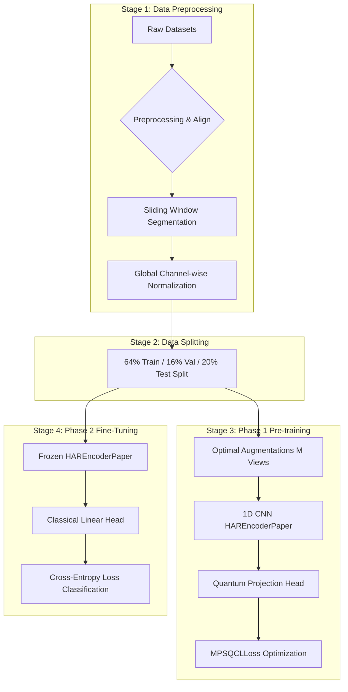

# End-to-End Pipeline: Data to Classification

This document outlines the complete end-to-end pipeline from raw data to classification, highlighting how preprocessing, augmentation, and neural architectures differ across datasets.

---

## Pipeline Architecture Overview

The pipeline consists of four major stages, implemented across the following modules:
1. **Data Ingestion & Preprocessing**: Code in [download_and_preprocess_datasets.py](file:///home/avnis/dev/projects/QMLHAR/src/data/download_and_preprocess_datasets.py) and [har_datasets_paper.py](file:///home/avnis/dev/projects/QMLHAR/src/data/har_datasets_paper.py).
2. **Dataset Loading & Train/Val/Test Splits**: Code in [get_paper_dataloaders](file:///home/avnis/dev/projects/QMLHAR/src/data/har_datasets_paper.py#L554-L663).
3. **Phase 1: Contrastive Pre-training (Unsupervised)**: Code in [pretrain](file:///home/avnis/dev/projects/QMLHAR/experiments/run_mpsqcl_har_paper.py#L53-L275) using [HAREncoderPaper](file:///home/avnis/dev/projects/QMLHAR/src/models/encoder.py#L111-L126), [QuantumProjectionHeadPaper](file:///home/avnis/dev/projects/QMLHAR/src/models/quantum_head.py#L93-L196), and [MPSQCLLoss](file:///home/avnis/dev/projects/QMLHAR/src/losses/mpsqcl_loss.py#L17-L129).
4. **Phase 2: Supervised Fine-Tuning & Classification**: Code in [finetune](file:///home/avnis/dev/projects/QMLHAR/experiments/run_mpsqcl_har_paper.py#L280-L478).

---

## 1. Dataset-Specific Preprocessing & Segmentation

Because the datasets come from different sensors, devices, sampling rates, and clinical protocols, their preprocessing pipelines are tailored:

| Dataset | Sensors / Channels | Window Size | Classes | Special Preprocessing / Filtering |
| :--- | :--- | :---: | :---: | :--- |
| **UCI-HAR** | 9 channels (3-axis body acc, 3-axis gyro, 3-axis total acc) | 128 | 6 | Already segmented in raw files. Mapped from $1\text{--}6 \to 0\text{--}5$. |
| **UniMiB-SHAR** | 3 channels (3-axis accelerometer only) | 151 | 17 | **Programmatically disregards the 10 out of 30 participants** who have incomplete activity records. Maps remaining class IDs contiguously. |
| **HHAR** | 6 channels (3-axis acc, 3-axis gyro) | 100 | 6 | Downsamples and aligns raw smartphone streams onto a synchronized **50 Hz grid** (20 ms step) using linear interpolation before windowing. |
| **MotionSense** | 12 channels (attitude yaw/pitch/roll, gravity xyz, gyro xyz, acc xyz) | 400 | 6 | Reads CSV folders by subject, segments with window size 400 (50% overlap). |
| **USC-HAD** | 6 channels (3-axis acc, 3-axis gyro) | 250 | 12 | Standardized from `.mat` files for 14 subjects. Segments with window size 250. |
| **MobiAct** | 6 channels (3-axis acc, 3-axis gyro) | 128 | 9 | Downsamples/interpolates acc and gyro streams onto a **50 Hz grid** (20 ms step). Filters out fall activities, keeping 9 ADL classes. |
| **Opportunity (Locomotion)** | 113 channels (body-worn IMUs, accelerometers, shoes) | 30 | 4 | Linearly interpolates NaNs inside feature columns. Excludes the Null locomotion class, mapping remaining $1\text{--}5 \to 0\text{--}3$. |
| **Opportunity (Gestures)** | 113 channels | 30 | 17 | Same NaN interpolation. Maps 17 distinct hand gestures. |

### Code Reference
- Preprocessing and alignment logic: [download_and_preprocess_datasets.py](file:///home/avnis/dev/projects/QMLHAR/src/data/download_and_preprocess_datasets.py)
- Windowing segmenter function: [segment_sliding_window](file:///home/avnis/dev/projects/QMLHAR/src/data/har_datasets_paper.py#L22-L53)
- Global feature normalizer (keeps channel scaling relative): [normalize_features](file:///home/avnis/dev/projects/QMLHAR/src/data/har_datasets_paper.py#L55-L61)

---

## 2. Dataset Split & Balanced Loading

To ensure paper compliance, all datasets are split and fed identically:
* **Train / Val / Test Split**: Preprocessed samples are split into **64% Train / 16% Validation / 20% Test** using [random_split](file:///home/avnis/dev/projects/QMLHAR/src/data/har_datasets_paper.py#L608-L610) with a fixed random seed (`42`).
* **Weighted Sampler**: The train dataset loader applies [WeightedRandomSampler](file:///home/avnis/dev/projects/QMLHAR/src/data/har_datasets_paper.py#L620-L624) based on inverse class frequency to handle class imbalances.

---

## 3. Phase 1: Multi-Positive Contrastive Pre-Training (VQC)

During contrastive pre-training, raw signals are projected into a quantum space using variational circuits and optimized using contrastive similarity:

1. **Multi-View Generation**: For each sample, the pipeline applies $M$ optimal transformations (from Table III of the paper) to produce $M$ distinct augmented views.
   * *UCI-HAR ($M=5$)*: `resample` + `perm_jit` + `noise` + `temporal_flip` + `rotate`
   * *HHAR ($M=6$)*: `resample` + `perm_jit` + `negate` + `noise` + `temporal_flip` + `rotate`
   * *MotionSense ($M=5$)*: `resample` + `perm_jit` + `noise` + `rotate` + `permute`
   * *USC-HAD ($M=4$)*: `time_warp` + `resample` + `perm_jit` + `noise`
   * *Others (Default)*: Randomly applies `resample` and `negate`.
   * **Augmentor Class**: [ContrastiveViewGeneratorPaper](file:///home/avnis/dev/projects/QMLHAR/src/data/augmentations_paper.py#L35-L98)

2. **1D CNN Feature Extractor**: The $M$ views are passed through [HAREncoderPaper](file:///home/avnis/dev/projects/QMLHAR/src/models/encoder.py#L111-L126). The encoder consist of:
   * **Layer 1**: $Conv1d(\text{channels}, 32, k=8)$ $\to$ BatchNorm $\to$ ReLU $\to$ MaxPool(2) $\to$ Dropout(0.35)
   * **Layer 2**: $Conv1d(32, 64, k=8)$ $\to$ BatchNorm $\to$ ReLU $\to$ MaxPool(2)
   * **Layer 3**: $Conv1d(64, 128, k=8)$ $\to$ BatchNorm $\to$ ReLU $\to$ MaxPool(2)
   * **Layer 4**: $Conv1d(128, 256, k=8)$ $\to$ BatchNorm $\to$ ReLU $\to$ AdaptiveMaxPool(1)
   * **Output**: A $256$-dimensional feature vector.

3. **Quantum Projection Head**: Maps the $256$-dim classical feature vector into quantum states:
   * **Amplitude Embedding**: Vector is encoded into an 8-qubit quantum state ($2^8 = 256$).
   * **PQC (Parameterized Quantum Circuit)**: Alternates Ry rotations (parameterized by learnable weights) and CNOT gates between adjacent qubits.
   * **Measurement**: Pauli-Z expectation values are measured, yielding an 8-dimensional projection.
   * **Output**: Projection is L2-normalized onto the unit hypersphere.
   * **VQC Class**: [QuantumProjectionHeadPaper](file:///home/avnis/dev/projects/QMLHAR/src/models/quantum_head.py#L93-L196)

4. **Multi-Positive Loss**: The [MPSQCLLoss](file:///home/avnis/dev/projects/QMLHAR/src/losses/mpsqcl_loss.py#L17-L129) calculates cosine similarity between all $M \times N$ views in the batch, maximizing similarity between positive views of the same sample, and minimizing similarity to negative samples.
   $$\mathcal{L}_{i} = \frac{1}{|P(i)|} \sum_{p \in P(i)} -\log \left( \frac{\exp(\text{sim}(z_i, z_p) / \tau)}{\sum_{k} \mathbb{1}_{[k \neq i]} \exp(\text{sim}(z_i, z_k) / \tau)} \right)$$

5. **Model Selection**: Pre-training runs for 120 epochs using the Adam optimizer with Cosine Annealing learning rate decay. The encoder state that yields the **lowest validation loss** is saved.

---

## 4. Phase 2: Supervised Fine-Tuning & Classification

To evaluate downstream classification accuracy, the pre-trained feature extractor is fine-tuned classically:

1. **Freezing the Encoder**: The best-performing pre-trained encoder weights are loaded, and gradients are frozen (`param.requires_grad = False`).
2. **Replacing the Projection Head**: The Quantum Projection Head is removed and replaced with a classical `nn.Linear(256, num_classes)` classifier.
3. **Training**: The classifier is trained on raw, unaugmented validation and training sets using standard **Cross-Entropy Loss** and the Adam optimizer ($LR=0.1$ with Cosine Annealing learning rate decay).
4. **Evaluation**: Downstream metrics including Accuracy, Macro F1-Score, and a Confusion Matrix are calculated on the 20% test split.
