# QCLHAR Pipeline Documentation: Quantum Contrastive Learning for Human Activity Recognition

This document provides a comprehensive end-to-end description of the pipeline proposed in the **QCLHAR** paper:
* **Paper Title**: *Quantum contrastive learning for human activity recognition* (Smart Health 2025)
* **Authors**: Yanhui Ren, Di Wang, Lingling An, Shiwen Mao, Xuyu Wang

It details the theoretical pipeline stages, how they are mapped onto the codebase, and provides an exhaustive side-by-side comparison of every minute difference between our **Paper-Compliant** pipeline and our **Standard** pipeline.

---

## 1. Theoretical Pipeline Architecture

The QCLHAR pipeline utilizes a hybrid classical-quantum self-supervised contrastive learning framework to learn robust features from unlabeled sensor data, which are then evaluated on downstream human activity classification.

```mermaid
flowchart TD
    subgraph Stage1 ["Stage 1: Data Preprocessing & Split"]
        Raw[Raw Wearable Sensor Data] --> Prep[Normalization & Segmenting]
        Prep --> Window[Sliding Window: 50% Overlap]
        Window --> Split[Random Split: 64% Train / 16% Val / 20% Test]
    end

    subgraph Stage2 ["Stage 2: Augmentation & Collation"]
        Split --> Sampler[Weighted Random Sampler]
        Sampler --> Aug[SimCLR 2 Views: Resample & Negate]
    end

    subgraph Stage3 ["Stage 3: Phase 1 Pre-Training"]
        Aug --> Encoder[1D CNN HAREncoderPaper]
        Encoder --> Feature[256-dim Classical Feature Vector]
        Feature --> VQC[Quantum Projection Head VQC]
        VQC --> Project[8-dim Expectations z_i, z_j]
    end

    subgraph Stage4 ["Stage 4: Contrastive Optimization"]
        Project --> Loss[NT-Xent Loss Calculation]
        Loss --> Opt[Optimize Encoder + VQC]
        Opt --> Checkpoint{Validation Loss Improvement?}
        Checkpoint -- Yes --> Save[Save Best Encoder Checkpoint]
    end

    subgraph Stage5 ["Stage 5: Phase 2 Fine-Tuning"]
        Save --> Load[Load Best Pre-trained Encoder]
        Load --> Freeze[Freeze Encoder Weight Gradients]
        Freeze --> Norm[L2-normalize Extracted Features]
        Norm --> Classifier[Classical Linear Head]
        Classifier --> CE[Cross-Entropy Loss Classification]
    end
```



---

## 2. Codebase Implementation Mapping

The theoretical stages are implemented in the codebase across the following modules:

* **Training Orchestration**: 
  - Paper-Compliant Pre-training & Fine-tuning: [experiments/run_qcl_har_paper.py](file:///home/avnis/dev/projects/QMLHAR/experiments/run_qcl_har_paper.py)
  - Standard Pre-training & Fine-tuning: [experiments/run_qcl_har.py](file:///home/avnis/dev/projects/QMLHAR/experiments/run_qcl_har.py)
* **Data Preprocessing & Loading**:
  - Dataloader split & balance generator: [get_paper_dataloaders](file:///home/avnis/dev/projects/QMLHAR/src/data/har_datasets_paper.py#L554-L663) in [har_datasets_paper.py](file:///home/avnis/dev/projects/QMLHAR/src/data/har_datasets_paper.py)
* **Data Augmentations**:
  - Paper-Compliant Generator: [ContrastiveViewGeneratorPaper](file:///home/avnis/dev/projects/QMLHAR/src/data/augmentations_paper.py#L35-L98) in [augmentations_paper.py](file:///home/avnis/dev/projects/QMLHAR/src/data/augmentations_paper.py)
  - Standard Generator: [ContrastiveViewGenerator](file:///home/avnis/dev/projects/QMLHAR/src/data/augmentations.py#L281-L318) in [augmentations.py](file:///home/avnis/dev/projects/QMLHAR/src/data/augmentations.py)
* **Neural Network Modules**:
  - Paper-Compliant Encoder: [HAREncoderPaper](file:///home/avnis/dev/projects/QMLHAR/src/models/encoder.py#L111-L126) in [encoder.py](file:///home/avnis/dev/projects/QMLHAR/src/models/encoder.py)
  - Standard Encoder: [HAREncoder](file:///home/avnis/dev/projects/QMLHAR/src/models/encoder.py#L18-L109) in [encoder.py](file:///home/avnis/dev/projects/QMLHAR/src/models/encoder.py)
  - Paper-Compliant Projection Head: [QuantumProjectionHeadPaper](file:///home/avnis/dev/projects/QMLHAR/src/models/quantum_head.py#L93-L196) in [quantum_head.py](file:///home/avnis/dev/projects/QMLHAR/src/models/quantum_head.py)
  - Standard Projection Head: [QuantumProjectionHead](file:///home/avnis/dev/projects/QMLHAR/src/models/quantum_head.py#L18-L91) in [quantum_head.py](file:///home/avnis/dev/projects/QMLHAR/src/models/quantum_head.py)
* **Loss Functions**:
  - SimCLR NT-Xent: [NTXentLoss](file:///home/avnis/dev/projects/QMLHAR/src/losses/ntxent.py#L16-L81) in [ntxent.py](file:///home/avnis/dev/projects/QMLHAR/src/losses/ntxent.py)

---

## 3. Paper-Compliant vs. Standard Pipeline Differences

There are key differences along every stage of the pipeline between the strict paper-compliant replication and the standard baseline implementation.

| Pipeline Stage | Paper-Compliant Setup (`run_qcl_har_paper.py`) | Standard Setup (`run_qcl_har.py`) | Rationale / Impact |
| :--- | :--- | :--- | :--- |
| **Stage 1: Preprocessing & Splitting** | Enables `WeightedRandomSampler` to balance class frequencies; hardcoded subject exclusions and grid downsampling. Split is exactly **64% / 16% / 20%**. | Standard random loading (`use_sampler=False` by default) with standard train/val/test splits. | The weighted random sampler oversamples minority classes, resolving training bias in imbalanced datasets. |
| **Stage 2: Augmentation** | Uses exactly $M=2$ views created from **2 strategies only**: Resampling and Negate (with deduplication). | Uses $M=2$ views drawn from a pool of **11 strategies** (jitter, negate, permute, resample, rotate, scale, temporal flip, time warp, window warp, channel shuffle, permutation-jitter). | Standard diverse augmentations prevent features from learning orientation/noise shortcuts, improving baseline representations. |
| **Stage 3: CNN Encoder** | Uses [HAREncoderPaper](file:///home/avnis/dev/projects/QMLHAR/src/models/encoder.py#L111-L126). Final block 4 uses **Adaptive Max Pooling 1D**. | Uses [HAREncoder](file:///home/avnis/dev/projects/QMLHAR/src/models/encoder.py#L18-L109). Final block 4 uses **Adaptive Average Pooling 1D** by default. | Max pooling captures peak signals (e.g. impact activities), while average pooling smoothes signal structures across the entire sequence. |
| **Stage 4: VQC Projection Head** | Uses [QuantumProjectionHeadPaper](file:///home/avnis/dev/projects/QMLHAR/src/models/quantum_head.py#L93-L196). Depth $D=1$ custom circuit with **8 parameters** (Ry + CNOT ring connecting adjacent qubits). | Uses [QuantumProjectionHead](file:///home/avnis/dev/projects/QMLHAR/src/models/quantum_head.py#L18-L91). Depth $D=3$ circuit with **72 parameters** (`StronglyEntanglingLayers`). | The paper head maximizes parameter efficiency. Standard StronglyEntanglingLayers increase circuit expressivity but scale simulation times. |
| **Stage 5: Pre-Training Loss & Logic** | Runs **validation loop** during pre-training. Selects the encoder yielding the **lowest validation loss**. LR defaults to **3e-3** (1e-2 for SHAR). | No validation loop during pre-training; simply saves the final epoch or periodic checkpoint. LR defaults to **1e-3**. | Saving the encoder with the lowest validation loss prevents representation overfitting. |
| **Stage 5: VQC Simulator Backpropagation** | Employs statevector backpropagation (`diff_method="backprop"`). | Implicitly falls back to parameter-shift derivative calculations (requires $2 \times N_{\text{params}}$ simulator runs per sample). | Backpropagation reduces pre-training runtimes by **100x** compared to parameter-shift on classical simulators. |
| **Stage 6: Fine-Tuning Classifier** | **Frozen** encoder (`requires_grad = False`). Features are **L2-normalized** before classification. Optimizer LR is **1e-1** (Adam, cosine annealing) for the classifier head. | **Unfrozen** encoder. Optimizer updates encoder slowly ($1\text{e-4}$) and classifier faster ($1\text{e-3}$). Features are not normalized. | Locking and L2-normalizing representations tests pure feature extraction. Unfreezing adapts the encoder, boosting downstream accuracy. |
| **NISQ Noise Simulation** | Supported via `--noise_prob` and `--noise_std` parameters. Simulates RX rotation errors before each quantum gate. | No noise simulation support. | Evaluates model robustness against NISQ hardware measurement errors. |
| **Target Metric** | Primary: **Macro F1-score**. Secondary: Test Accuracy. | Primary: **Test Accuracy**. | F1-score is highly sensitive to minority classes in imbalanced classification. |

---

## 4. Comprehensive Stage-by-Stage Implementation Details

### Stage 1: Data Preparation & Preprocessing
* **Sensor Channels**: Extracts accelerometer and gyroscope streams depending on the dataset. HHAR uses 6 channels, MotionSense uses accelerometer-only (3 channels) in the paper, whereas standard utilizes 12 channels.
* **Segmentation**: Continuous signals are partitioned using sliding windows with a **50% overlap**. Window sizes:
  - UCI-HAR: 128 timesteps
  - SHAR: 151 timesteps
  - HHAR: 100 timesteps (downsampled to 50 Hz, phone devices only)
  - MotionSense: 400 timesteps
  - USC-HAD: 250 timesteps
  - MobiAct: 128 timesteps (falls excluded, ADL classes only)
* **Splitting**: Split into **64% Train / 16% Val / 20% Test** random sets.
* **Code Implementation**:
  ```python
  train_loader, val_loader, test_loader, in_channels, _, num_classes = get_paper_dataloaders(
      dataset_name=args.dataset,
      data_dir=args.data_dir,
      batch_size=args.batch_size,
      transform=transform,
      collate_fn=contrastive_collate_fn,
      seed=args.seed
  )
  ```

### Stage 2: Data Augmentation
* **Resample**: Shifts sensor sample frequency via linear interpolation, then resizes back to original size.
* **Negate**: Flips signal polarities: $x \to -x$.
* **Replication Logic**: In pre-training, each signal $x$ is copied into two streams. Resampling and negation are applied independently to each view with a 50% probability. A deduplication loop runs until the two generated views are structurally distinct.
* **Code Implementation**:
  ```python
  transform = ContrastiveViewGeneratorPaper(n_views=2)
  # Standard code uses:
  transform = ContrastiveViewGenerator(n_views=2)
  ```

### Stage 3: Classical Feature Extraction (CNN Encoder)
* **Network Layout**: A 4-layer Fully Convolutional Network (FCN).
  - *Layer 1*: $Conv1D(\text{in\_channels}, 32, k=8) \to BatchNorm \to ReLU \to MaxPool(2) \to Dropout(0.35)$
  - *Layer 2*: $Conv1D(32, 64, k=8) \to BatchNorm \to ReLU \to MaxPool(2)$
  - *Layer 3*: $Conv1D(64, 128, k=8) \to BatchNorm \to ReLU \to MaxPool(2)$
  - *Layer 4 (Paper-Compliant)*: $Conv1D(128, 256, k=8) \to BatchNorm \to ReLU \to AdaptiveMaxPool1D(1) \to Squeeze$
  - *Layer 4 (Standard)*: $Conv1D(128, 256, k=8) \to BatchNorm \to ReLU \to AdaptiveAvgPool1D(1) \to Squeeze$
* **Output**: A 256-dimensional feature vector.
* **Code Implementation**:
  ```python
  # Paper-compliant
  encoder = HAREncoderPaper(in_channels=in_channels, feature_dim=256)
  # Standard
  encoder = HAREncoder(in_channels=in_channels, feature_dim=256)
  ```

### Stage 4: Quantum Projection Head (VQC)
* **Quantum Embedding**: Classically normalized 256-dimensional features are mapped onto the amplitudes of an 8-qubit system ($2^8 = 256$) using **Amplitude Encoding**.
* **Variational Layers (PQC)**:
  - *Paper-Compliant*: Appears as a single layer ($D=1$). On each qubit $j$, a parameterized rotation $RY(\theta_j)$ is applied. Adjacent qubits are then entangled via a ring of CNOT gates: $CNOT(0,1), CNOT(1,2), \dots, CNOT(6,7)$. It contains exactly 8 learnable parameters.
  - *Standard*: Alternates $D=3$ layers of $StronglyEntanglingLayers$ containing $3 \text{ layers} \times 8 \text{ qubits} \times 3 \text{ rotations} = 72$ learnable parameters.
* **Measurement**: Measures expectation values of the Pauli-Z operator on all 8 qubits, yielding an 8-dimensional projection:
  $$z_j = \langle \psi \vert \sigma_z^j \vert \psi \rangle, \quad j \in [0, 7]$$
  The projection is L2-normalized onto the unit hypersphere.
* **Code Implementation**:
  ```python
  # Paper-compliant
  quantum_head = QuantumProjectionHeadPaper(input_dim=256, num_qubits=8, q_layers=1)
  # Standard
  quantum_head = QuantumProjectionHead(input_dim=256, num_qubits=8, q_layers=3)
  ```

### Stage 5: Phase 1 Pre-Training (NT-Xent Loss)
* **Optimization Objective**: Pushes representations of positive views together and negative views apart.
* **NT-Xent Formulation**:
  $$L_i = -\log \frac{\exp(\text{sim}(z_i^1, z_i^2) / \tau)}{\exp(\text{sim}(z_i^1, z_i^2) / \tau) + \sum_{k=1}^{2B} \mathbb{1}_{[k \neq i]} \exp(\text{sim}(z_i^1, z_k) / \tau)}$$
  Where $B$ is the batch size, $\tau=0.1$ is the temperature, and similarity is computed as the quantum state inner product (cosine similarity).
* **Optimizer**: Adam optimizer with weight decay $1\text{e-}5$. Pre-training is executed for 120 epochs using Cosine Annealing learning rate decay.
* **Code Implementation**:
  ```python
  criterion = NTXentLoss(temperature=args.temperature)
  optimizer = optim.Adam(list(encoder.parameters()) + list(quantum_head.parameters()), lr=lr)
  scheduler = optim.lr_scheduler.CosineAnnealingLR(optimizer, T_max=args.epochs)
  ```

### Stage 6: Phase 2 Fine-Tuning & Classification
* **Encoder Freezing**: Encoder weights are locked (`param.requires_grad = False` and `.eval()`), acting strictly as a static feature extractor.
* **Linear Classifier**: The VQC head is discarded and replaced with a classical linear layer (`nn.Linear(256, num_classes)`).
* **Training Logic**: Features extracted from raw sequences are **L2-normalized** and passed through the classifier. It is optimized under Cross-Entropy Loss for 100 epochs using Adam ($LR=0.1$) with Cosine Annealing learning rate decay.
* **Code Implementation**:
  ```python
  # Freeze encoder
  for param in encoder.parameters():
      param.requires_grad = False
  encoder.eval()

  classifier = nn.Linear(256, num_classes).to(device)
  optimizer = optim.Adam(classifier.parameters(), lr=1e-1)
  
  # Forward pass in training loop
  with torch.no_grad():
      features = encoder(inputs)
      features = torch.nn.functional.normalize(features, p=2, dim=1) # L2 Normalization
  logits = classifier(features)
  ```

---

## 5. Paper-Compliance Notes

While the paper-compliant replication script ([run_qcl_har_paper.py](file:///home/avnis/dev/projects/QMLHAR/experiments/run_qcl_har_paper.py)) and the associated paper classes strictly adhere to the QCLHAR paper (Smart Health 2025) architectures, loss functions, optimization schedules, datasets, splits, and pre-training validation loop, the following implementation choices were added for engineering robustness and numerical stability:

1. **Adam Weight Decay ($1\text{e-}5$)**: Not explicitly specified in the paper, but introduced to stabilize training and prevent early parameter divergence.
2. **Feature L2 Normalization in Fine-Tuning**: Features extracted by the frozen CNN encoder are $L_2$-normalized prior to feeding them to the linear classifier (Stage 6). This stabilizes linear classification learning dynamics, though not explicitly detailed in the paper text.
3. **Adaptive Pooling Variant**: The paper specifies "max-pooling" after each layer. The codebase utilizes `AdaptiveMaxPool1D` in the paper-compliant layout (and `AdaptiveAvgPool1D` in standard layout) to map variable-length sequences to a fixed feature shape without requiring hardcoded padding changes for different datasets.

